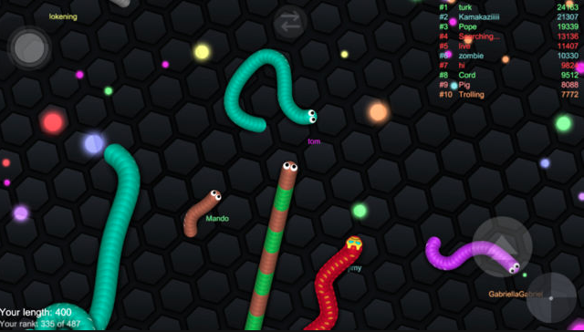

Multithreaded Snakes Game (multi-node)
======================================

Implement a multithreaded version of the video game
[Snake](https://en.wikipedia.org/wiki/Snake_(video_game_genre)). This
version will be a Computer vs Human game. Each enemy will be
independent and the number of enemies is configurable. Below you can
see the general requirements for the enemies and human player (snake)
interation. Also, this game must be implemented in a multi-node
architecure, more details below.

Multi-node architecture
-----------------------

Your Snakes game should be able to run on top of `n` number of
machines, it's your choice the way you implement it, but it looks a
good candidate for a master-server and worker-client(s). Once a game
is configured in the server, it will wait a pre-defined time for the
clients to join the race. The clients can be configurable, human or
computer based ones. Remember, you are free to design and implement,
just make sure it works in a multi-node architecture.

Technical Requirements
----------------------
- The game's layout can be static.
- Food dots can be randomly located in the layout.
- Number of food dots must be configured in the game's tart.
- The main `snake` gamer must be controlled by the user.
- Enemy snakes are autonomous entities that will move a random way.
- Enemy snakes and main snake should respect the layout limits and walls.
- Enemy snakes number can be configured on game's start.
- Each enemy's behaviour will be implemented as a separated thread.
- Enemy snakes and main sneak threads must use the same map or game layout data structure resource.
- Display obtained main snake's scores.
- Main snake grow one unit on every eaten food dot.
- Enemy snakes can also grow when they touch food dots.
- Main snake loses when it has been hit 10 times by other snake or it touches the limits or walls.
- Main snake wins the game when all food dots have eaten and main snake has the largest lenght.

General Requirements
--------------------
- Make sure that you complete the below defined deliverables.
- Source code dependencies must be clearly documented.

Deliverables
------------
- Source code can be in a single student's account and the other team members can contribute to the same repository.
- Architecture Document - [ARCHITECTURE.md](ARCHITECTURE.md)
  - Details on how you designed and implemented your solution
  - Project architecture description, diagrams, charts and everything related to the way you think/design/build your program
- Build/Run automation (`Makefile` and documentation - [SNAKES.md](SNAKES.md))
  - Instructions on how to build and run your program
- Project's presentation (5-10 minutes)
  - A video presentation that will be delivered to the professor, in youtube preferable

Permitted programming languages
-------------------------------
- Multithreaded core backend
  - C
  - Go
- User Interface (optional)
  - Any
  - If it's terminal, output must be human-readable

Grading Policy
--------------
| Concept                      | Grade |
|------------------------------|-------|
| Architecture Document        | 20%   |
| Multithreaded implementation | 30%   |
| Build Automation             | 20%   |
| Coding best practices        | 10%   |
| Presentation                 | 20%   |
| TOTAL                        | 100%  |

- **Free Bonus Lab**

You can get an extra bonus if you implement an Artificial Intelligence algorithm in enemies behaviour for finding the main snake location, trace the route and follow it. This must be documented in the `ARCHITECTURE.md` file.